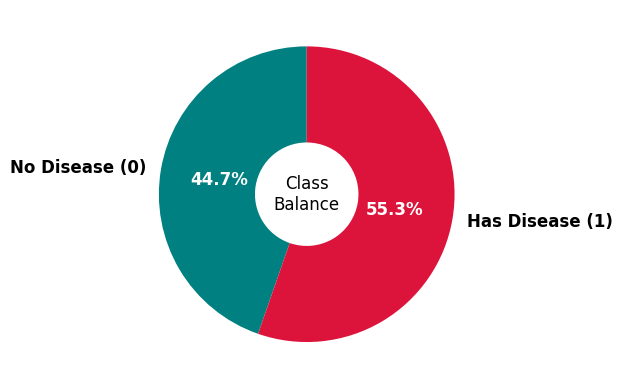
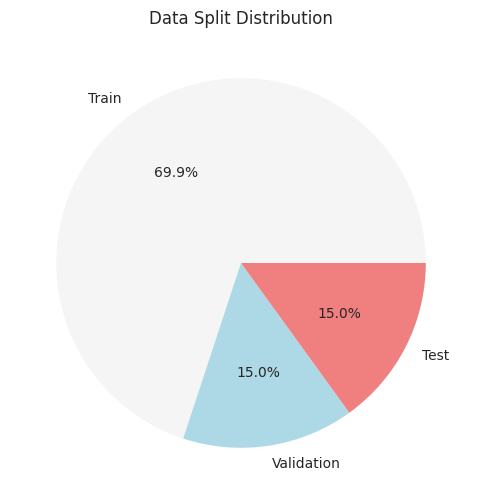
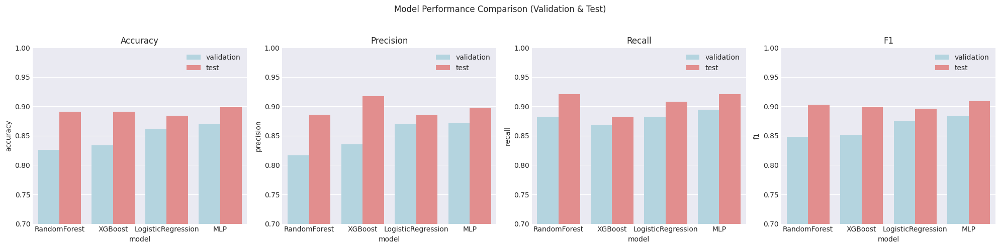
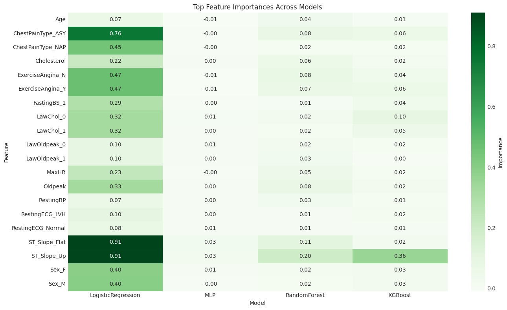

# Heart Failure Prediction
This report is a simple walkthrough of my journey building machine learning models to predict heart disease. I’ll explain what I did, why I did it, what worked, what didn’t, and what I’d do next. If you’re new to data science, don’t worry—I’ll keep things easy to follow and highlight the most important points.

 

## 1. Data Understanding

**What data did I use?**
- The dataset contains information about people’s health, like age, blood pressure, cholesterol, chest pain type, and whether they have heart disease.
- There are both numbers (like age) and categories (like chest pain type).

**Why is this data important?**
- Doctors use these features to decide if someone might have heart disease.
- The goal is to help predict heart disease early, so people can get the right care.

 

### Target Balance 
The dataset is nearly balanced, with 44.7% of patients not having heart disease and 55.3% having heart disease. There are no missing values, which simplifies the data preparation process. 

 

 

### Features Relationships vs. Target 

 

<table style="border-collapse: collapse; width: 100%; font-family: 'Segoe UI', Tahoma, Geneva, Verdana, sans-serif; font-size: 15px; background: white;">
    <thead>
    <tr style="background: linear-gradient(135deg, crimson, #2c3e50); color: white;">
        <th style="padding: 14px 16px; text-align: left; font-weight: 600;">Feature</th>
        <th style="padding: 14px 16px; text-align: left; font-weight: 600;">Risk Indicator</th>
        <th style="padding: 14px 16px; text-align: left; font-weight: 600;">Notes</th>
    </tr>
    </thead>
    <tbody>
    <tr><th>Categorical Features</th></tr>
    <tr style="transition: background-color 0.2s;">
        <td style="padding: 12px 16px; border-bottom: 1px solid #ecf0f1; font-weight: 600;">Sex = M</td>
        <td style="padding: 12px 16px; border-bottom: 1px solid #ecf0f1; color: #e74c3c; font-weight: 500;">Higher risk</td>
        <td style="padding: 12px 16px; border-bottom: 1px solid #ecf0f1;">Males are more prone to heart issues, especially at younger ages</td>
    </tr>
    <tr style="background-color: #f8f9fa; transition: background-color 0.2s;">
        <td style="padding: 12px 16px; border-bottom: 1px solid #ecf0f1; font-weight: 600;">FastingBS = 1</td>
        <td style="padding: 12px 16px; border-bottom: 1px solid #ecf0f1; color: #e74c3c; font-weight: 500;">Higher risk</td>
        <td style="padding: 12px 16px; border-bottom: 1px solid #ecf0f1;">High fasting blood sugar (likely diabetic) increases heart risk</td>
    </tr>
    <tr style="transition: background-color 0.2s;">
        <td style="padding: 12px 16px; border-bottom: 1px solid #ecf0f1; font-weight: 600;">ExerciseAngina = Y</td>
        <td style="padding: 12px 16px; border-bottom: 1px solid #ecf0f1; color: #e74c3c; font-weight: 500;">Higher risk</td>
        <td style="padding: 12px 16px; border-bottom: 1px solid #ecf0f1;">Indicates chest pain during exertion — often a sign of blocked arteries</td>
    </tr>
    <tr style="background-color: #f8f9fa; transition: background-color 0.2s;">
        <td style="padding: 12px 16px; border-bottom: 1px solid #ecf0f1; font-weight: 600;">ChestPainType = ASY</td>
        <td style="padding: 12px 16px; border-bottom: 1px solid #ecf0f1; color: #e74c3c; font-weight: 500;">Higher risk</td>
        <td style="padding: 12px 16px; border-bottom: 1px solid #ecf0f1;">Asymptomatic patients can still have serious heart conditions</td>
    </tr>
    <tr style="transition: background-color 0.2s;">
        <td style="padding: 12px 16px; border-bottom: 1px solid #ecf0f1; font-weight: 600;">ST_Slope = Flat</td>
        <td style="padding: 12px 16px; border-bottom: 1px solid #ecf0f1; color: #e74c3c; font-weight: 500;">Higher risk</td>
        <td style="padding: 12px 16px; border-bottom: 1px solid #ecf0f1;">Associated with ST depression and reduced blood flow during exercise</td>
    </tr>
    <tr style="background-color: #f8f9fa; transition: background-color 0.2s;">
        <td style="padding: 12px 16px; border-bottom: 1px solid #ecf0f1; font-weight: 600;">RestingECG = LVH</td>
        <td style="padding: 12px 16px; border-bottom: 1px solid #ecf0f1; color: #f39c12; font-weight: 500;">Moderate risk</td>
        <td style="padding: 12px 16px; border-bottom: 1px solid #ecf0f1;">Suggests left ventricular hypertrophy — a possible indicator of strain</td>
    </tr>
    <tr><th>Numerical Features</th></tr>
    <tr style="transition: background-color 0.2s;">
        <td style="padding: 12px 16px; border-bottom: 1px solid #ecf0f1; font-weight: 600;">Age</td>
        <td style="padding: 12px 16px; border-bottom: 1px solid #ecf0f1; font-weight: 500; color: #e74c3c;">↑ Higher age → ↑ risk</td>
        <td style="padding: 12px 16px; border-bottom: 1px solid #ecf0f1;">Cardiovascular vulnerability increases with age</td>
    </tr>
    <tr style="background-color: #f8f9fa; transition: background-color 0.2s;">
        <td style="padding: 12px 16px; border-bottom: 1px solid #ecf0f1; font-weight: 600;">RestingBP</td>
        <td style="padding: 12px 16px; border-bottom: 1px solid #ecf0f1; font-weight: 500;">Slightly elevated in heart disease</td>
        <td style="padding: 12px 16px; border-bottom: 1px solid #ecf0f1;">Limited standalone predictive value due to significant group overlap</td>
    </tr>
    <tr style="transition: background-color 0.2s;">
        <td style="padding: 12px 16px; border-bottom: 1px solid #ecf0f1; font-weight: 600;">Cholesterol</td>
        <td style="padding: 12px 16px; border-bottom: 1px solid #ecf0f1; font-weight: 500; color: #7f8c8d;">No clear pattern (inconclusive)</td>
        <td style="padding: 12px 16px; border-bottom: 1px solid #ecf0f1;">Impact may be better assessed through feature combinations</td>
    </tr>
    <tr style="background-color: #f8f9fa; transition: background-color 0.2s;">
        <td style="padding: 12px 16px; border-bottom: 1px solid #ecf0f1; font-weight: 600;">MaxHR</td>
        <td style="padding: 12px 16px; border-bottom: 1px solid #ecf0f1; font-weight: 500; color: #e74c3c;">↓ Lower in heart disease</td>
        <td style="padding: 12px 16px; border-bottom: 1px solid #ecf0f1;">Reduced peak heart rate indicates impaired cardiac response to stress</td>
    </tr>
    <tr style="transition: background-color 0.2s;">
        <td style="padding: 12px 16px; border-bottom: 1px solid #ecf0f1; font-weight: 600;">Oldpeak</td>
        <td style="padding: 12px 16px; border-bottom: 1px solid #ecf0f1; font-weight: 500; color: #e74c3c;">↑ Higher in heart disease</td>
        <td style="padding: 12px 16px; border-bottom: 1px solid #ecf0f1;">Indicates ST depression, suggesting myocardial ischemia during exercise</td>
    </tr>
    </tbody>
</table>

  

## 2. Data Preparation

**How did I prepare the data?**
- I split the data into three parts: 70% for training, 15% for validation, and 15% for testing. This helps make sure the models are fair and not just memorizing the answers.
- I turned categories (like chest pain type) into numbers using one-hot encoding, so the computer can understand them.
- I scaled the number features (like age and cholesterol) so they’re all on a similar scale. This helps some models work better.

 

 

## 3. Modelling

**What models did I try?**
- **Random Forest:** Like a team of decision trees voting together. Good for most problems.
- **XGBoost:** A powerful boosting method, often wins competitions.
- **Logistic Regression:** A simple, classic model for yes/no problems.
- **MLP (Neural Network):** A basic artificial brain, learns patterns in the data.

**How did I train and test them?**
- I used grid search and cross-validation to find the best settings for each model.
- I checked how well each model did on the validation and test sets, using accuracy, precision, recall, and F1-score.

 

## 4. Model Comparison & Feature Importance

**How did the models compare?**
- All models performed similarly, with high accuracy (around 89%).
- The most important features were things like ST segment slope, exercise-induced angina, chest pain type, and oldpeak.

**What does this mean?**
- The models agree on what’s important, which matches what doctors expect.
- No single model was a clear winner, but all gave useful insights.

 

## Reflection
**What I Did Right**
- I used a fair data split and cross-validation to avoid overfitting.
- I tried several types of models, from simple to more complex.
- I checked feature importance to understand what drives predictions.
- I kept the process transparent and reproducible.

 

**What I Did Wrong / Could Improve**

- I could have tried more advanced models or combined models (ensembles) for even better results.
- I didn’t do much feature engineering—creating new features or combining existing ones might help.
- I could have looked for more data or tried to balance the classes if they were uneven.
- I didn’t use external validation (like data from another hospital) to check if the models generalize.
- I could have spent more time on data cleaning and outlier detection.

 

**Next Steps**

- Try ensemble methods: Combine several models for better accuracy.
- Add more data: More data usually means better models.
- Read research papers: See what the latest science says about heart disease prediction.
- Work with doctors: Get expert feedback to make the models more useful in real life.
- Deploy the model: Build a simple app or dashboard for doctors or patients.

  

Thank you for reading!  
*See you in the next episode*
